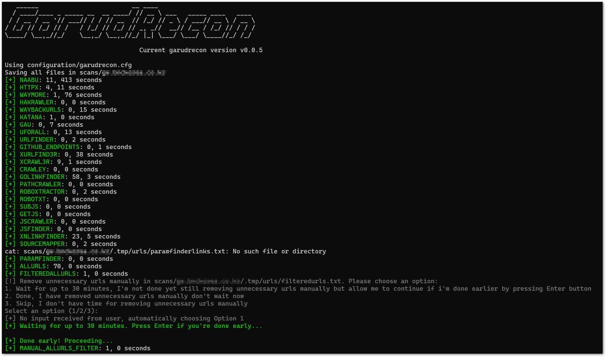
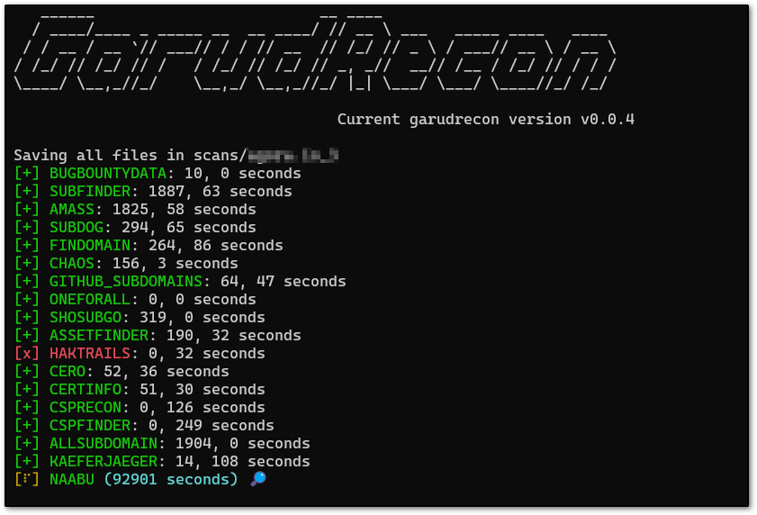
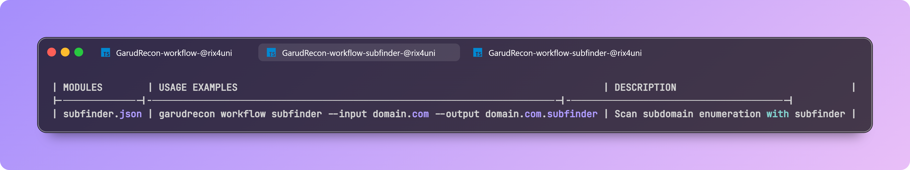
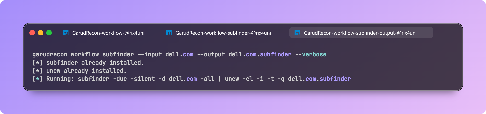
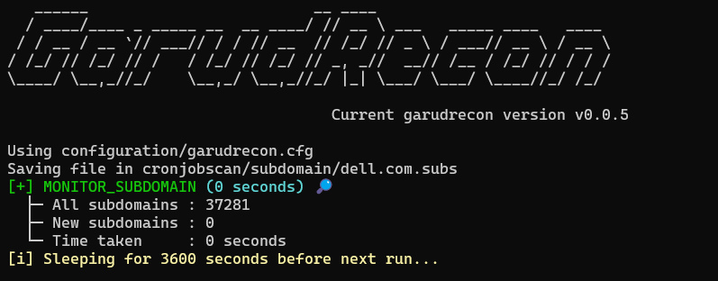
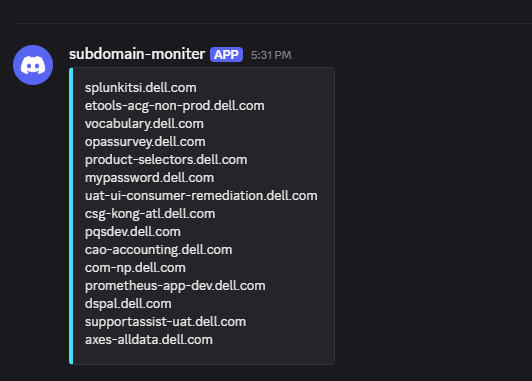
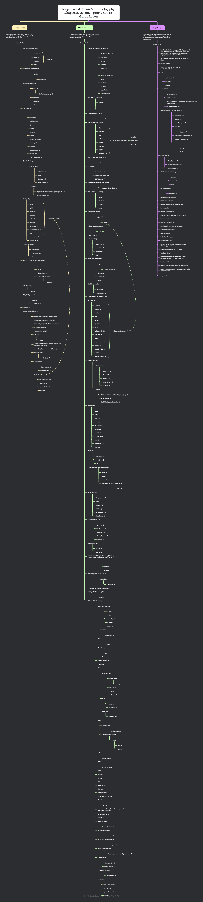

<p align="center">
<a href="#"></a>
<a href="https://ko-fi.com/rix4uni"></a>
<a href="https://x.com/rix4uni"></a>
<a href="https://github.com/rix4uni/GarudRecon/issues"></a>
<a href="https://github.com/rix4uni/GarudRecon/blob/master/LICENSE"></a>
<a href="#"></a>
<a href="https://github.com/rix4uni?tab=followers"></a>
<a href="https://github.com/rix4uni/GarudRecon/stargazers"></a>
<a href="https://github.com/rix4uni/GarudRecon/forks"></a>
</p>

## GarudRecon

GarudRecon is a comprehensive bash-based reconnaissance automation framework that streamlines the asset discovery and vulnerability assessment process for security professionals and bug bounty hunters. This tool orchestrates over 80+ open-source security tools to provide thorough reconnaissance capabilities across multiple attack vectors.

## Table of Contents

- [Core Capabilities](#core-capabilities)
- [Flexible Reconnaissance Modes](#flexible-reconnaissance-modes)
- [Advanced Features](#advanced-features)
- [History](#history)
- [Prerequisites](#prerequisites)
- [Installation](#installation)
- [Quick Start](#quick-start)
- [Usage](#usage)
- [Configuration](#configuration)
- [Troubleshooting](#troubleshooting)
- [FAQ](#faq)
- [Contributing](#contributing)
- [Operating Systems Supported](#operating-systems-supported)
- [Tools](#tools)
- [Thanks](#thanks-)

### Core Capabilities
GarudRecon excels in automated discovery and vulnerability detection across several key areas:

**Asset Discovery & Enumeration**
- Subdomain enumeration using 20+ tools including subfinder, amass, and chaos
- Certificate transparency monitoring through multiple CT log sources  
- DNS enumeration with advanced bruteforcing and permutation techniques
- Port scanning with naabu, masscan, and nmap integration
- Virtual host discovery and web technology fingerprinting

**Vulnerability Detection**
- Cross-Site Scripting (XSS) detection with multiple payload sets
- SQL injection testing through automated parameter fuzzing
- Local File Inclusion (LFI) and Remote Code Execution (RCE) checks
- Subdomain takeover vulnerability scanning
- Open redirect detection and validation
- Exposed .git directories and sensitive file discovery

### Flexible Reconnaissance Modes
The framework provides three distinct operational modes tailored to different engagement scopes:
- **SmallScope Mode** - Designed for focused subdomain reconnaissance (e.g., support.domain.com) with deep vulnerability analysis on a limited attack surface.
- **MediumScope Mode** - Comprehensive wildcard domain scanning (e.g., *.domain.com) with balanced coverage and performance optimization.
- **LargeScope Mode** - Organization-wide reconnaissance for maximum asset discovery and extensive vulnerability coverage.
- **CidrScope Mode** - ⚠️ Coming Soon - CIDR-based reconnaissance for IP range scanning
- **Workflow Mode** - Chain multiple tools into a reusable pipeline so you can run complex scans with a single command.
- **Fleet Mode** - Distribute work across many VPS instances — split input automatically and run workflows in parallel on 100+ hosts.
- **CronJobs Mode** - Schedule and monitor recurring recon tasks (subdomains, open ports, JS leaks, templates, alerts).

### Advanced Features
**Automated Monitoring**
- Continuous subdomain monitoring with change detection
- Port state change notifications  
- JavaScript file monitoring for new endpoints
- Automated scheduled reconnaissance via cron integration

**Intelligent Resource Management**
- RAM-optimized configurations for different system specifications
- VPS deployment optimization settings
- Parallel processing with configurable thread limits
- Custom wordlist generation based on target characteristics

## History
I originally created **GarudRecon** in 2022, but I later removed it after some API keys were accidentally leaked. Despite this, someone forked the project and preserved it [here](https://github.com/polling-repo-continua/GarudRecon).

Afterwards, I experimented with rewriting GarudRecon in **Python** and **Go**, but I found the heavy string concatenation in those languages unappealing. In the end, I decided to return to **Bash**, which felt simpler and more natural for me.

## Prerequisites

Before installing GarudRecon, ensure you have:

- **Root access** (switch to root user, not `sudo su`)
- **Bash shell** (verify with `echo $SHELL`)
- **Internet connection** for downloading tools and dependencies
- **Minimum 4GB RAM** (8GB+ recommended for large scans)
- **Sufficient disk space** (at least 10GB free for tools and output)

## Referral Links

<details open>
  <summary><b>Click to view cloud provider referral links</b></summary>

<p align="center">
<a href="https://m.do.co/c/43c704381b79" target="_blank">

</a>
</p>

<p align="center">
<a href="https://login.linode.com/signup" target="_blank">

</a>
</p>

<p align="center">
<a href="https://cloud.ibm.com/docs/overview?topic=overview-tutorial-try-for-free" target="_blank">

</a>
</p>

<p align="center">
<a href="https://aws.com" target="_blank">

</a>
</p>

<p align="center">
<a href="https://azure.com" target="_blank">

</a>
</p>

<p align="center">
<a href="https://cloud.intechdc.com/?affid=443&oid=99" target="_blank">

</a>
</p>
</details>

## Installation

> **Note:** Switch to the **root** user first (instead of using `sudo su`) before running the installation command.  
> This helps avoid permission and environment-related issues.  
>  
> If any tool fails to install during the script execution, install it manually.  
>  
> Make sure your shell is set to **bash**.

### Docker
> **Note:** Docker support is coming soon. For now, please use the Git Clone or prebuilt binaries installation method.

### Quick Install (No Clone Required)
```
# Install directly via curl (recommended for quick setup)
bash <(curl -s https://raw.githubusercontent.com/rix4uni/GarudRecon/main/setup)
```

### Using Git Clone
```
git clone --depth 1 https://github.com/rix4uni/GarudRecon.git
cd GarudRecon
bash setup
```

### Download prebuilt binaries
```
wget -q https://github.com/rix4uni/GarudRecon/archive/refs/tags/v0.1.2.zip
unzip v0.1.2.zip
cd GarudRecon
bash setup
```

> **Note:** The `setup` script automatically downloads and installs pre-built binaries from [GarudReconBinary nightly releases](https://github.com/rix4uni/GarudReconBinary/releases/download/nightly/GarudReconBinary.zip) for faster installation.

## Quick Start

After installation, you can immediately start using GarudRecon:

```yaml
# Small scope scan (single subdomain)
garudrecon smallscope -d support.example.com

# Medium scope scan (wildcard domain)
garudrecon mediumscope -d example.com

# Large scope scan (organization-wide)
garudrecon largescope -d example

# Workflow mode
garudrecon workflow ls

# CronJobs mode
garudrecon cronjobs -d example.com -f MONITOR_SUBDOMAIN
```

For more detailed usage examples, see the [Usage](#usage) section below.

## Configuration

GarudRecon uses configuration files located in `configuration/` directory. The main configuration file is `garudrecon.cfg`.

### Key Configuration Options

- **API Keys**: Configure API keys for various services (subfinder, amass, chaos, etc.)
- **Thread Limits**: Adjust parallel processing threads based on your system resources
- **Output Directories**: Customize where scan results are stored
- **Tool Paths**: Specify custom paths if tools are installed in non-standard locations

To use a custom configuration file:
```yaml
garudrecon mediumscope -d example.com -c /path/to/custom.cfg
```

## Usage

<details open>
  <summary><b>SmallScope Mode</b></summary>

```yaml
Quick recon for a single host or subdomain (e.g. support.domain.com).
Lightweight, fast checks — ideal for a single target when you want quick visibility without a full-scale scan.

Usage:
  garudrecon smallscope [flags]

Flags:
  -d, --domain                          Scan a domain (e.g. support.domain.com)
  -ef, --exclude-functions              Exclude a function from running (e.g. WAYMORE)
  -rx, --recon-xss                      Run full recon with XSS checks
  -rs, --recon-sqli                     Run full recon with SQLi checks
  -rl, --recon-lfi                      Run full recon with LFI checks
  -rst, --recon-subtakeover             Run full recon with Subdomain Takeover checks
  -rr, --recon-rce                      Run full recon with RCE checks
  -ri, --recon-iis                      Run full recon with IIS checks
  -c, --config                          Custom configuration file path
  -r, --resume <scan_folder>            Resume stopped/uncompleted scan from /root/.garudrecon/scans/<scan_folder> (e.g., --resume support.domain.com or --resume support.domain.com_1). Skips functions already completed in resume.cfg.
  -h, --help                            help for smallscope

Example:
# Full recon
  garudrecon smallscope -d support.domain.com

# Recon with XSS only
  garudrecon smallscope -d support.domain.com -rx

# Recon with SQLi only
  garudrecon smallscope -d support.domain.com -rs

# Exclude functions manually
  garudrecon smallscope -d support.domain.com -ef "GOSPIDER,WAYMORE"

# Combined
  garudrecon smallscope -d support.domain.com -rx -ef "WAYMORE"

# Skips functions already completed in resume.cfg.
  garudrecon smallscope -d support.domain.com -rx --resume support.domain.com_1
```

#### Output

</details>


<details open>
  <summary><b>MediumScope Mode</b></summary>

```yaml
Moderate recon for a wildcard domain (e.g. *.domain.com) with optional vuln checks.
Balanced scan depth: discovers subdomains, does basic service/port checks and optional lightweight vulnerability checks.

Usage:
  garudrecon mediumscope [flags]

Flags:
  -d, --domain                          Scan a domain (e.g. domain.com)
  -ef, --exclude-functions              Exclude a function from running (e.g. AMASS)
  -s, --recon-subdomain                 Run Subdomain Enumeration only
  -a, --active                          Run Active Subdomain Enumeration also (e.g. puredns, altdns)
  -su, --recon-subdomainurls            Run Subdomain Enumeration + Url Crawling only
  -rx, --recon-xss                      Run full recon with XSS checks
  -rs, --recon-sqli                     Run full recon with SQLi checks
  -rl, --recon-lfi                      Run full recon with LFI checks
  -rst, --recon-subtakeover             Run full recon with Subdomain Takeover checks
  -rr, --recon-rce                      Run full recon with RCE checks
  -ri, --recon-iis                      Run full recon with IIS checks
  -oos, --outofscope                    Exclude outofscope subdomains from a list (e.g. domain.com.oos)
  -c, --config                          Custom configuration file path
  -r, --resume <scan_folder>            Resume stopped/uncompleted scan from /root/.garudrecon/scans/<scan_folder> (e.g., --resume domain.com or --resume domain.com_1). Skips functions already completed in resume.cfg.
  -h, --help                            help for mediumscope

Example:
# Full recon with all vulnerability scan
  garudrecon mediumscope -d domain.com

# Recon Subdomain Enumeration only
  garudrecon mediumscope -d domain.com -s

# Run Active Subdomain Enumeration also (e.g. puredns, altdns)
  garudrecon mediumscope -d domain.com -s -a

# Recon Subdomain Enumeration + Url Crawling only
  garudrecon mediumscope -d domain.com -su

# Recon with XSS only
  garudrecon mediumscope -d domain.com -rx

# Recon with SQLi only
  garudrecon mediumscope -d domain.com -rs

# Exclude functions manually
  garudrecon mediumscope -d domain.com -ef "SUBFINDER,AMASS"

# Combined
  garudrecon mediumscope -d domain.com -rx -ef "AMASS"

# Skips functions already completed in resume.cfg.
  garudrecon mediumscope -d domain.com -rx --resume domain.com_1
```

#### Output

</details>


<details open>
  <summary><b>LargeScope Mode</b></summary>

```yaml
Full-scale recon for an organization.
Deep discovery and enumeration (subdomains, ports, asset correlation, extensive vuln checks) for comprehensive coverage.

Usage:
  garudrecon largescope [flags]

Flags:
  -d, --domain                          Scan a domain (e.g. domain)
  -ef, --exclude-functions              Exclude a function from running (e.g. AMASS)
  -s, --recon-subdomain                 Run Subdomain Enumeration only
  -a, --active                          Run Active Subdomain Enumeration also (e.g. puredns, altdns)
  -su, --recon-subdomainurls            Run Subdomain Enumeration + Url Crawling only
  -rx, --recon-xss                      Run full recon with XSS checks
  -rs, --recon-sqli                     Run full recon with SQLi checks
  -rl, --recon-lfi                      Run full recon with LFI checks
  -rst, --recon-subtakeover             Run full recon with Subdomain Takeover checks
  -rr, --recon-rce                      Run full recon with RCE checks
  -ri, --recon-iis                      Run full recon with IIS checks
  -oos, --outofscope                    Exclude outofscope subdomains from a list (e.g. domain.oos)
  -c, --config                          Custom configuration file path
  -r, --resume <scan_folder>            Resume stopped/uncompleted scan from /root/.garudrecon/scans/<scan_folder> (e.g., --resume domain or --resume domain_1). Skips functions already completed in resume.cfg.
  -h, --help                            help for largescope

Example:
# Full recon with all vulnerability scan
  garudrecon largescope -d domain

# Recon Subdomain Enumeration only
  garudrecon largescope -d domain -s

# Run Active Subdomain Enumeration also (e.g. puredns, altdns)
  garudrecon largescope -d domain -s -a

# Recon Subdomain Enumeration + Url Crawling only
  garudrecon largescope -d domain -su

# Recon with XSS only
  garudrecon largescope -d domain -rx

# Recon with SQLi only
  garudrecon largescope -d domain -rs

# Exclude functions manually
  garudrecon largescope -d domain -ef "SUBFINDER,AMASS"

# Combined
  garudrecon largescope -d domain -rx -ef "AMASS"

# Skips functions already completed in resume.cfg.
  garudrecon largescope -d domain -rx --resume domain_1
```

#### Output

</details>


<details open>
  <summary><b>CidrScope Mode</b></summary>

> **⚠️ Coming Soon:** CIDR-based reconnaissance mode for IP range scanning is currently under development.

This mode will allow you to:
- Scan entire CIDR ranges for open ports and services
- Discover assets within IP ranges
- Perform vulnerability assessments on IP-based targets

Stay tuned for updates!

#### Output
_Coming soon_
</details>


<details open>
  <summary><b>Workflow Mode</b></summary>

```yaml
Chain multiple tools into a reusable pipeline so you can run complex scans with a single command.
Compose small steps (mapcidr → httpx → nuclei …) into one workflow file and execute it without manually installing or running each tool.

Usage:
  garudrecon workflow [flags]

Flags:
  -i, --input       Pass the input
  -o, --output      Location where you want to save output
  -v, --verbose     enable verbose mode
  -h, --help        help for workflows

Example:
  garudrecon workflow amass --input <domain> --output <file> [--verbose]
  garudrecon workflow CVE-2025-0133 -i all.cidr -o CVE-2025-0133.nuclei
  garudrecon workflow ls
  garudrecon workflow ls [workflow]
  garudrecon workflow cat [workflow]
  garudrecon workflow add [workflow]
  garudrecon workflow edit [workflow]
  garudrecon workflow delete [workflow]
```

### Validating Workflows

To check if all workflow JSON files are valid:

```bash
for f in workflow/*.json; do
  echo -n "Checking $f ... "
  jq empty "$f" && echo "✅ OK" || echo "❌ INVALID"
done
```

#### Output



</details>


<details open>
  <summary><b>Fleet Mode</b></summary>

> **Note:** Progress bar and enhanced monitoring features are included. Use `fleetsetup` to automate worker configuration.

### Setup

1. **Create fleet.yaml configuration file:**

```yaml
# Create the configuration file
mkdir -p ~/.garudrecon
nano ~/.garudrecon/fleet.yaml
```

Add your credentials in YAML format:
```yaml
worker:
  - root@192.168.1.10:PASSWORD1
  - root@192.168.1.11:PASSWORD2
  - root@192.168.1.12:PASSWORD3
master:
  - root@192.168.1.1:MASTER_PASSWORD
```

> **Note:** To avoid single/double quotes problems with passwords, you can use the [password encoder](https://codepen.io/rix4uni/pen/PwZzdpV)

2. **Setup in master VPS:**

Run this command directly on your master VPS (no need to clone the repo):

```bash
bash <(curl -s https://raw.githubusercontent.com/rix4uni/GarudRecon/main/setup)
```

3. **Setup in workers (run this in master VPS):**

After master setup is complete, run this command on the master VPS to automatically configure all workers. The `fleetsetup` script will:
- Install GarudRecon on all worker VPS instances
- Set up SSH keys for passwordless communication
- Test connectivity between master and workers

```bash
bash <(curl -s https://raw.githubusercontent.com/rix4uni/GarudRecon/main/fleetsetup)
```

> **Note:** Both `setup` and `fleetsetup` can be run directly via curl without cloning the repository.

Options:
- `--skip-install` - Skip GarudRecon installation (only setup SSH keys)
- `--skip-keys` - Skip SSH key setup (only install GarudRecon)
- `--test-only` - Only test connectivity (skip installation and key setup)

### Usage

```yaml
Distribute work across many VPS instances — split input automatically and run workflows in parallel on 100+ hosts.
Use one command to shard data, push jobs to remote nodes, run the chosen workflow, and collect consolidated results. Perfect for massively-parallel scans.

Usage:
  garudrecon fleet [flags]

Flags:
  -i, --input       Pass the input
  -o, --output      Location where you want to save output
  -m, --module      workflow name you want to run
  -v, --verbose     enable verbose mode
  -h, --help        help for workflows

Example:
  garudrecon fleet -m <workflow> -i <wildcards> -o <file> [--verbose]
  garudrecon fleet -m httpx -i subs.txt -o subs.httpx --verbose
  garudrecon fleet -m subfinder -i wildcards.txt -o wildcards.subs
```

### Testing

After setup, test with a simple scan:

```bash
# Create test input file
echo "example.com" > subs.txt
echo "test.example.com" >> subs.txt

# Run fleet test
garudrecon fleet -m httpx -i subs.txt -o subs.httpx --verbose
```

</details>


<details open>
  <summary><b>CronJobs Mode</b></summary>

```yaml
Schedule and monitor recurring recon tasks (subdomains, open ports, JS leaks, templates, alerts).
Run continuous monitoring: periodic scans, delta detection, and notifications when new assets or issues appear.

Usage:
  garudrecon cronjobs [flags]

Flags:
  -d, --domain                  Domain to monitor
  -f, --function                Function to run (e.g. MONITOR_SUBDOMAIN)
  -c, --config                  Custom configuration file path
  -i, --interval                Customize the sleep duration (e.g. 1800)
  -v, --verbose                 enable verbose mode
  -h, --help                    help for cronjobs

Example:
  garudrecon cronjobs -d domain.com -f MONITOR_SUBDOMAIN
  garudrecon cronjobs -d domain.com -f MONITOR_PORTS
  garudrecon cronjobs -d domain.com -f MONITOR_ALIVESUBD
  garudrecon cronjobs -d domain.com -f MONITOR_JS
  garudrecon cronjobs -d domain.com -f MONITOR_JSLEAKS
```

#### Output


</details>

<details open>
  <summary><b>✅ Short commands</b></summary>

```yaml
👉 Short commands automatically adds in ~/.bashrc during installation:
gs="garudrecon smallscope"
gm="garudrecon mediumscope"
gl="garudrecon largescope"
gcidr="garudrecon cidrscope"
gw="garudrecon workflow"
gf="garudrecon fleet"
gc="garudrecon cronjobs"
```
</details>

## Demo

> **Note:** Demo videos and screenshots coming soon. Check the [Usage](#usage) section for output examples.

For visual demonstrations, see the output screenshots in each mode's section above.

## Troubleshooting

### Common Issues

**Issue: Permission denied errors**
- **Solution:** Make sure you're running as root user (not using `sudo su`). Switch to root with `su -` or `sudo -i`.

**Issue: Tools not installing**
- **Solution:** Install failed tools manually. Check the installation logs for specific errors. Ensure you have internet connectivity and sufficient disk space.

**Issue: Bash not found**
- **Solution:** Verify your shell is bash: `echo $SHELL`. If not, switch to bash: `bash` or `chsh -s /bin/bash`.

**Issue: Scan stops or hangs**
- **Solution:** Check system resources (RAM, disk space). Use `-ef` flag to exclude problematic functions. Use `--resume` to continue interrupted scans.

**Issue: API rate limits**
- **Solution:** Configure API keys in the configuration file to increase rate limits. Some tools have free tier limitations.

### Getting Help

- Check existing [Issues](https://github.com/rix4uni/GarudRecon/issues)
- Create a new issue with:
  - Error messages
  - Command used
  - System information
  - Relevant logs

## FAQ

**Q: Do I need to install all tools manually?**  
A: No, the `setup` script automatically installs most tools. If any tool fails, you'll need to install it manually.

**Q: Can I run scans without root access?**  
A: Some tools require root access for certain operations (like port scanning). It's recommended to run as root.

**Q: How long do scans typically take?**  
A: Scan duration is highly variable and depends on many factors:
- **Target size**: Number of subdomains, endpoints, and assets discovered
- **Enabled tools**: Which functions are included/excluded (via `-ef` flag or `DEFAULT_EXCLUDE_FUNCS` in config)
- **Scan modes**: NORMAL vs ADVANCED modes for various tools (configured in `garudrecon.cfg`)
- **TIMELIMITX settings**: Time limits set for individual tools (e.g., `WAYMORE_TIMELIMITX="1h"`)
- **RAM profile**: System RAM determines which tools run (1g/2g profiles exclude many tools)
- **System resources**: CPU, RAM, disk I/O, and network speed
- **API rate limits**: Some tools are limited by API quotas

A small target with minimal tools might complete in minutes, while a large organization scan with all tools enabled could take days. Check your configuration file (`garudrecon.cfg`) to see which tools and modes are active.

**Q: Can I pause and resume scans?**  
A: Yes! Use the `--resume` flag with the scan folder name to continue interrupted scans.

**Q: How do I exclude specific tools from running?**  
A: Use the `-ef` flag: `garudrecon mediumscope -d example.com -ef "AMASS,SUBFINDER"`

**Q: Where are scan results stored?**  
A: Results are stored in `/root/.garudrecon/scans/<domain>/` by default.

**Q: Can I customize which vulnerability checks run?**  
A: Yes, use flags like `-rx` for XSS, `-rs` for SQLi, `-rl` for LFI, etc. See the [Usage](#usage) section for details.

## Contributing

Contributions are welcome! Here's how you can help:

1. **Report Bugs**: Open an issue with detailed information
2. **Suggest Features**: Share your ideas for improvements
3. **Submit Pull Requests**: 
   - Fork the repository
   - Create a feature branch
   - Make your changes
   - Submit a pull request

### Development Guidelines

- Follow existing code style and conventions
- Test your changes thoroughly
- Update documentation as needed
- Ensure backward compatibility when possible

For more details, see [CONTRIBUTING.md](CONTRIBUTING.md) (if available) or open an issue to discuss your contribution.

## Operating Systems Supported

| OS         | Supported | Easy Install | Tested        |
| ---------- | --------- | ------------ | ------------- |
| Ubuntu     | ✅       | ✅          | Ubuntu 24.04   |
| Kali       | ✅       | ✅          | Kali 2025.2    |
| Debian     | ✅       | ✅          | ❌             |
| Windows    | ✅       | ✅          | WSL Ubuntu     |
| MacOS      | ✅       | ✅          | ❌             |
| Arch Linux | ✅       | ❌          | ❌             |

## Tools

### Subdomain Enumeration
- [subfinder](https://github.com/projectdiscovery/subfinder)
- [amass](https://github.com/owasp-amass/amass)
- [subdog](https://github.com/rix4uni/subdog)
- [xsubfind3r](https://github.com/hueristiq/xsubfind3r)
- [findomain](https://github.com/Findomain/Findomain)
- [chaos](https://github.com/projectdiscovery/chaos-client)
- [github-subdomains](https://github.com/gwen001/github-subdomains)
- [bbot](https://github.com/blacklanternsecurity/bbot)
- [shosubgo](https://github.com/incogbyte/shosubgo)
- [assetfinder](https://github.com/tomnomnom/assetfinder)
- [haktrails](https://github.com/hakluke/haktrails)
- [haktrailsfree](https://github.com/rix4uni/haktrailsfree)
- [org2asn](https://github.com/rix4uni/org2asn)
- [ipfinder](https://github.com/rix4uni/ipfinder)
- [arinrange](https://github.com/rix4uni/arinrange)
- [spk](https://github.com/dhn/spk)
- [analyticsrelationships](https://github.com/Josue87/analyticsrelationships)
- [udon](https://github.com/dhn/udon)
- [builtwithsubs](https://github.com/rix4uni/builtwithsubs)
- [whoxysubs](https://github.com/rix4uni/whoxysubs)

### Certificate Transparency
- [cero](https://github.com/glebarez/cero)
- [certinfo](https://github.com/rix4uni/certinfo)
- [csprecon](https://github.com/edoardottt/csprecon)
- [cspfinder](https://github.com/rix4uni/cspfinder)
- [jsubfinder](https://github.com/ThreatUnkown/jsubfinder)
- [subwiz](https://github.com/hadriansecurity/subwiz)

### Subdomain Permutations
- [altdns](https://github.com/infosec-au/altdns)
- [puredns](https://github.com/d3mondev/puredns)
- [alterx](https://github.com/projectdiscovery/alterx)
- [gotator](https://github.com/Josue87/gotator)
- [dnsgen](https://github.com/ProjectAnte/dnsgen)
- [goaltdns](https://github.com/subfinder/goaltdns)
- [ripgen](https://github.com/resyncgg/ripgen)
- [dmut](https://github.com/bp0lr/dmut)

### Subdomain Resolving
- [puredns](https://github.com/d3mondev/puredns)
- [shuffledns](https://github.com/projectdiscovery/shuffledns)
- [massdns](https://github.com/blechschmidt/massdns)

### Subdomain DNS Enumeration
- [dnsx](https://github.com/projectdiscovery/dnsx)

### Port Scanning
- [naabu](https://github.com/projectdiscovery/naabu)
- [masscan](https://github.com/robertdavidgraham/masscan)
- [rustscan](https://github.com/RustScan/RustScan)
- [nmap](https://github.com/nmap/nmap)

### Subdomain Probing
- [httpx](https://github.com/projectdiscovery/httpx)

### Subdomain Bruteforcing
- [subdomainfuzz](https://github.com/rix4uni/subdomainfuzz)

### VHOST Discovery
- [ffuf](https://github.com/ffuf/ffuf)

### Favicon Lookup
- [favinfo](https://github.com/rix4uni/favinfo)
- [favirecon](https://github.com/edoardottt/favirecon)

### Screenshotting
- [gowitness](https://github.com/sensepost/gowitness)
- [httpx](https://github.com/projectdiscovery/httpx)

### Directory Enumeration
- [ffuf](https://github.com/ffuf/ffuf)
- [dirsearch](https://github.com/maurosoria/dirsearch)
- [feroxbuster](https://github.com/epi052/feroxbuster)

### Email Enumeration
- [emailfinder](https://github.com/rix4uni/emailfinder)

### Url Crawling
- [waymore](https://github.com/xnl-h4ck3r/waymore)
- [hakrawler](https://github.com/hakluke/hakrawler)
- [waybackurls](https://github.com/tomnomnom/waybackurls)
- [katana](https://github.com/projectdiscovery/katana)
- [gau](https://github.com/lc/gau)
- [gospider](https://github.com/jaeles-project/gospider)
- [uforall](https://github.com/rix4uni/uforall)
- [cariddi](https://github.com/edoardottt/cariddi)
- [urlfinder](https://github.com/projectdiscovery/urlfinder)
- [github-endpoints](https://github.com/gwen001/github-endpoints)
- [xurlfind3r](https://github.com/hueristiq/xurlfind3r)
- [xcrawl3r](https://github.com/hueristiq/xcrawl3r)
- [crawley](https://github.com/s0rg/crawley)
- [GoLinkFinder](https://github.com/rix4uni/GoLinkFinder)
- [galer](https://github.com/dwisiswant0/galer)
- [gourlex](https://github.com/trap-bytes/gourlex)
- [pathfinder](https://github.com/Print3M/pathfinder)
- [pathcrawler](https://github.com/rix4uni/pathcrawler)
- [roboxtractor](https://github.com/Josue87/roboxtractor)
- [robotxt](https://github.com/rix4uni/robotxt)

### Google Dorking
- [gorker](https://github.com/rix4uni/gorker)

### JS Crawling
- [subjs](https://github.com/lc/subjs)
- [getJS](https://github.com/003random/getJS)
- [jscrawler](https://github.com/rix4uni/jscrawler)
- [jsfinder](https://github.com/kacakb/jsfinder)
- [linkfinder](https://github.com/GerbenJavado/LinkFinder)
- [xnLinkFinder](https://github.com/xnl-h4ck3r/xnLinkFinder)
- [sourcemapper](https://github.com/denandz/sourcemapper)
- [linx](https://github.com/riza/linx)
- [jsluice](https://github.com/BishopFox/jsluice)

### Hidden Parameter
- [paramfinder](https://github.com/rix4uni/paramfinder)
- [msarjun](https://github.com/rix4uni/msarjun)
- [x8](https://github.com/Sh1Yo/x8)

### Program Based Wordlist Generator
- [unfurl](https://github.com/tomnomnom/unfurl)

### Subdomain Takeover
- [subzy](https://github.com/rix4uni/subzy)
- [nuclei](https://github.com/projectdiscovery/nuclei)

### MX Takeover
- [mx-takeover](https://github.com/musana/mx-takeover)

### DNS takeover
- [dnstake](https://github.com/pwnesia/dnstake)

### Zone Transfer
- dig (built-in system tool)

### Vulnerability Scanning
- [ftpx](https://github.com/rix4uni/ftpx)
- [s3scanner](https://github.com/sa7mon/s3scanner)
- [vulntechfinder](https://github.com/rix4uni/vulntechfinder)
- [pvreplace](https://github.com/rix4uni/pvreplace)
- [xsschecker](https://github.com/rix4uni/xsschecker)
- [pyxss](https://github.com/rix4uni/pyxss)
- [gosqli](https://github.com/rix4uni/gosqli)
- [commix](https://github.com/commixproject/commix)
- [goop](https://github.com/nyancrimew/goop)
- [trufflehog](https://github.com/trufflesecurity/trufflehog)
- [mantra](https://github.com/MrEmpy/mantra)
- [shortscan](https://github.com/bitquark/shortscan)
- [linkinspector](https://github.com/rix4uni/linkinspector)
- [brutespray](https://github.com/x90skysn3k/brutespray)

## Thanks 🙏
_Thanks for creating awesome tools_

<details>
  <summary><b><a href="https://github.com/projectdiscovery">projectdiscovery</a></b></summary>

- [httpx](https://github.com/projectdiscovery/httpx)
- [nuclei](https://github.com/projectdiscovery/nuclei)
- [subfinder](https://github.com/projectdiscovery/subfinder)
- [cvemap](https://github.com/projectdiscovery/cvemap)
- [katana](https://github.com/projectdiscovery/katana)
- [naabu](https://github.com/projectdiscovery/naabu)
- [mapcidr](https://github.com/projectdiscovery/mapcidr)
- [shuffledns](https://github.com/projectdiscovery/shuffledns)
- [uncover](https://github.com/projectdiscovery/uncover)
- [asnmap](https://github.com/projectdiscovery/asnmap)
- [cdncheck](https://github.com/projectdiscovery/cdncheck)
- [dnsx](https://github.com/projectdiscovery/dnsx)
- [chaos](https://github.com/projectdiscovery/chaos)
- [tldfinder](https://github.com/projectdiscovery/tldfinder)
- [alterx](https://github.com/projectdiscovery/alterx)
- [tlsx](https://github.com/projectdiscovery/tlsx)
- [interactsh-client](https://github.com/projectdiscovery/interactsh-client)

</details>


<details open>
  <summary><b><a href="https://github.com/tomnomnom">tomnomnom</a></b></summary>

- [httprobe](https://github.com/tomnomnom/httprobe)
- [assetfinder](https://github.com/tomnomnom/assetfinder)
- [waybackurls](https://github.com/tomnomnom/waybackurls)
- [fff](https://github.com/tomnomnom/fff)
- [meg](https://github.com/tomnomnom/meg)
- [anew](https://github.com/tomnomnom/anew)
- [gron](https://github.com/tomnomnom/gron)
- [unfurl](https://github.com/tomnomnom/unfurl)
- [gf](https://github.com/tomnomnom/gf)
- [qsreplace](https://github.com/tomnomnom/qsreplace)

</details>


<details open>
  <summary><b><a href="https://github.com/rix4uni">rix4uni</a></b></summary>

- [gocl](https://github.com/rix4uni/gocl)
- [gobuild](https://github.com/rix4uni/gobuild)
- [subdog](https://github.com/rix4uni/subdog)
- [stoppiracy](https://github.com/rix4uni/stoppiracy)
- [oosexclude](https://github.com/rix4uni/oosexclude)
- [emailextractor](https://github.com/rix4uni/emailextractor)
- [nsfwdetector](https://github.com/rix4uni/nsfwdetector)
- [querygen](https://github.com/rix4uni/querygen)
- [haktrailsfree](https://github.com/rix4uni/haktrailsfree)
- [org2asn](https://github.com/rix4uni/org2asn)
- [vulntechfinder](https://github.com/rix4uni/vulntechfinder)
- [sftpsender](https://github.com/rix4uni/sftpsender)
- [wordcount](https://github.com/rix4uni/wordcount)
- [whoxysubs](https://github.com/rix4uni/whoxysubs)
- [techfinder](https://github.com/rix4uni/techfinder)
- [ip2org](https://github.com/rix4uni/ip2org)
- [certinfo](https://github.com/rix4uni/certinfo)
- [xsschecker](https://github.com/rix4uni/xsschecker)
- [xssrecon](https://github.com/rix4uni/xssrecon)
- [gosqli](https://github.com/rix4uni/gosqli)
- [portmap](https://github.com/rix4uni/portmap)
- [tldscan](https://github.com/rix4uni/tldscan)
- [paramfinder](https://github.com/rix4uni/paramfinder)
- [Gxss](https://github.com/rix4uni/Gxss)
- [msarjun](https://github.com/rix4uni/msarjun)
- [socialfinder](https://github.com/rix4uni/socialfinder)
- [waybackurlsx](https://github.com/rix4uni/waybackurlsx)
- [originiphunter](https://github.com/rix4uni/originiphunter)
- [GoLinkFinder](https://github.com/rix4uni/GoLinkFinder)
- [linkinspector](https://github.com/rix4uni/linkinspector)
- [wordgen](https://github.com/rix4uni/wordgen)
- [bbpscraper](https://github.com/rix4uni/bbpscraper)
- [pvreplace](https://github.com/rix4uni/pvreplace)
- [ftpx](https://github.com/rix4uni/ftpx)
- [subzy](https://github.com/rix4uni/subzy)
- [timelimitx](https://github.com/rix4uni/timelimitx)
- [jscrawler](https://github.com/rix4uni/jscrawler)
- [robotxt](https://github.com/rix4uni/robotxt)
- [pathcrawler](https://github.com/rix4uni/pathcrawler)
- [uforall](https://github.com/rix4uni/uforall)
- [emailfinder](https://github.com/rix4uni/emailfinder)
- [favinfo](https://github.com/rix4uni/favinfo)
- [dlevel](https://github.com/rix4uni/dlevel)
- [subdomainfuzz](https://github.com/rix4uni/subdomainfuzz)
- [cspfinder](https://github.com/rix4uni/cspfinder)
- [dirless](https://github.com/rix4uni/dirless)
- [gitxpose](https://github.com/rix4uni/gitxpose)
- [bxssreplace](https://github.com/rix4uni/bxssreplace)
- [ipfinder](https://github.com/rix4uni/ipfinder)

</details>


<details open>
  <summary><b><a href="https://github.com/hakluke">hakluke</a></b></summary>

- [hakrawler](https://github.com/hakluke/hakrawler)
- [hakrevdns](https://github.com/hakluke/hakrevdns)
- [haklistgen](https://github.com/hakluke/haklistgen)
- [hakoriginfinder](https://github.com/hakluke/hakoriginfinder)
- [hakcheckurl](https://github.com/hakluke/hakcheckurl)
- [haktrails](https://github.com/hakluke/haktrails)
- [hakip2host](https://github.com/hakluke/hakip2host)

</details>


<details open>
  <summary><b><a href="https://github.com/jaeles-project">jaeles-project</a></b></summary>

- [gospider](https://github.com/jaeles-project/gospider)
- [jaeles](https://github.com/jaeles-project/jaeles)

</details>


<details open>
  <summary><b><a href="https://github.com/lc">lc</a></b></summary>

- [gau](https://github.com/lc/gau)
- [subjs](https://github.com/lc/subjs)

</details>

## Thanks for #bugbountytips 🙏
- https://xmind.app/m/hKKexj
- https://x.com/ADITYASHENDE17/status/1527294113552297986
- https://youtu.be/rbyifgOQIrc?t=17m38s

## Changelog

See [CHANGELOG.md](CHANGELOG.md) for detailed version history and updates.

> **Note:** Changelog file coming soon. Check [releases](https://github.com/rix4uni/GarudRecon/releases) for version updates.

## Mindmap
_See Mindmap in different format [mindmap](mindmap)_

<p align="center"> 
<a href="mindmap/Scope-Based-Recon.png" target="_blank"> 

</a>  
</p>
